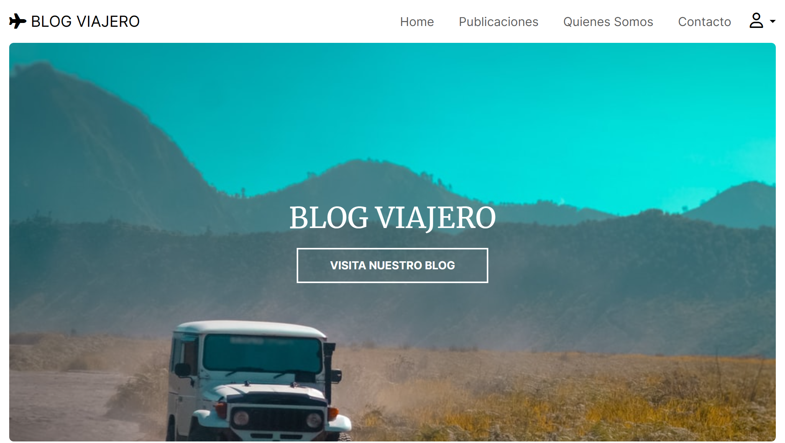

# Proyecto Final - BLOG VIAJERO
Comision 7 - Grupo 4

En el siguiente repositorio presentamos una aplicación web utilizando el framework Django y aplicando los conocimientos que fuimos adquiriendo durante el curso. Esta aplicación web es de tipo BLOG con la tematica de TURISMO/VIAJES.

## Caracteristicas 🛠️

- **Desarrollada con Django:** Utilizamos el framework Django para crear una aplicación robusta y fácil de mantener.
- **Secciones Bien Organizadas:** Presentamos diversas secciones para ofrecer una experiencia de usuario completa, incluyendo:

    - **Home:** La página de inicio donde los usuarios pueden obtener una visión general de las últimas publicaciones, links generales.
    - **Publicaciones:** Lista todas las publicaciones y permite a los visitantes filtrarlas según sus intereses.
    - **Quienes Somos:** Un espacio dedicado para contar al equipo detrás del BLOG VIAJERO.
    - **Contacto:** Facilitamos el contacto directo con nuestro equipo para cualquier consulta.
    - **Registro, Login y Logout:** Implementamos un sistema de registro y autenticación de usuarios para mejorar la experiencia personalizada.
- **Interacción de Usuarios:** En la pagina se puede comentar, dar "Me Gusta". El colaborador puede administrar las publicaciones...

## Autores ✒️

- **Carlos Lazovich** - [CarlosLazovich](https://github.com/CarlosLazovich)
- **Victoria Martin** - [viccmartin](https://github.com/viccmartin)
- **Diego Saavedra** - [Dieg0saave06](https://github.com/Dieg0saave06)
- **Giuliano Rossi** - [RossiGiuliano](https://github.com/RossiGiuliano)
- **Dario Chacon** - [darioalej](https://github.com/darioalej)
